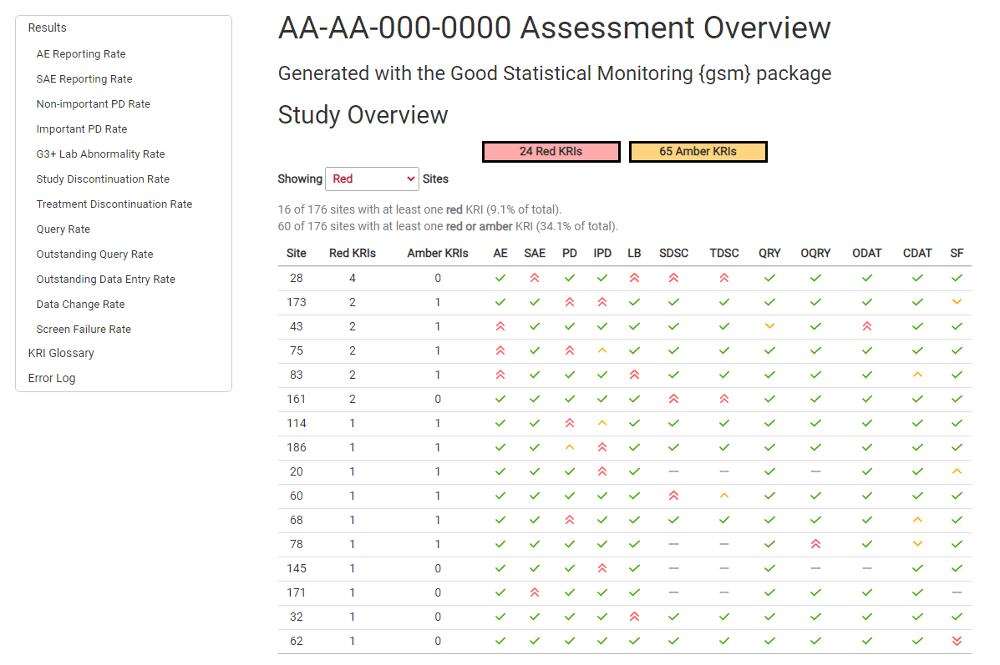

# gsm.kri

<!-- badges: start -->
[](https://github.com/Gilead-BioStats/gsm.kri/actions) 
<!-- badges: end -->

The {gsm} ecosystem provides a standardized Risk Based Quality Monitoring (RBQM) framework for clinical trials that pairs a flexible data pipeline with robust reports like the one shown below.  

<center> 
 


</center>


The `{gsm.kri}` package provides the necessary functions and workflows to produce the data visualizations, widgets and tables that ultimately go into an html KRI report. This package also provides the functions and scripts that generate the html KRI reports.
This README provides a high-level overview of {gsm.kri}; see the [package website](https://gilead-biostats.github.io/gsm.kri/) for additional details.


## Installation

You can install the development version of gsm.kri like so:

``` r
# install.packages("pak")
pak::pak("Gilead-BioStats/gsm.kri@dev")
```

## Sample Code

This is a basic example showing how to  which shows you how to solve a common problem:

``` r
library(gsm.kri)
library(gsm)

#### Visualize SAE Metric distribution using Bar Charts using provided htmlwidgets
labels <- list(  
  Metric= "Serious Adverse Event Rate",
  Numerator= "Serious Adverse Events",
  Denominator= "Days on Study"
)

# filter gsm sample data for one KRI and one snapshot
SAE_KRI <- reportingResults %>% 
            dplyr::filter(MetricID == "Analysis_kri0002" & SnapshotDate == "2012-12-31")

Widget_BarChart(dfResults = SAE_KRI, lMetric=labels, strOutcome="Metric")
Widget_BarChart(dfResults = SAE_KRI, lMetric=labels, strOutcome="Score")
Widget_BarChart(dfResults = SAE_KRI, lMetric=labels, strOutcome="Numerator")

### Create SAE Scatter plot with confidence bounds
dfBounds <- gsm::reportingBounds %>%
              dplyr::filter(MetricID == "Analysis_kri0002" & SnapshotDate == "2012-12-31")
Widget_ScatterPlot(SAE_KRI, lMetric = labels, dfBounds = dfBounds)

#### Site-Level KRI Report with multiple SnapshotDate

# First, create a list of charts using data output from `{gsm.reporting}` 
# For this example, we are using sample reporting data from `{gsm}`
lCharts <- MakeCharts(
  dfResults = gsm::reportingResults,
  dfGroups = gsm::reportingGroups,
  dfMetrics = gsm::reportingMetrics,
  dfBounds = gsm::reportingBounds
)

# Feed charts and reporting data into `Report_KRI()` to create the html report.
kri_report_path <- Report_KRI(
  lCharts = lCharts,
  dfResults =  FilterByLatestSnapshotDate(gsm::reportingResults),
  dfGroups =  gsm::reportingGroups,
  dfMetrics = gsm::reportingMetrics
)
```
Full reports for a sample trial run with [`{clindata}`](https://github.com/Gilead-BioStats/clindata) are provided below:

- [Site Report](https://gilead-biostats.github.io/gsm.kri/report_kri_site.html)
- [Country Report](https://gilead-biostats.github.io/gsm.kri/report_kri_country.html)

